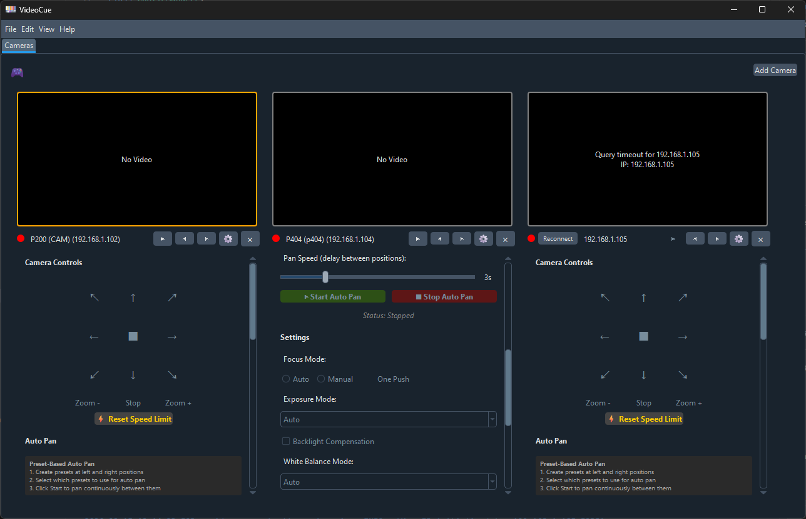

# VideoCue - Python Edition

A multi-camera PTZ controller using VISCA-over-IP protocol with NDI video streaming and USB game controller support.



## Features

### Camera Control
- **Multi-camera Management**: Control multiple PTZ cameras simultaneously
- **NDI Video Streaming**: Live preview with automatic NDI source discovery
- **VISCA-over-IP Protocol**: Industry-standard PTZ control via UDP
- **Camera Presets**: Store and recall pan/tilt/zoom positions per camera

### Cue Tab
- **Cue Sequencing**: Dedicated Cues tab for building ordered cue rows
- **Multi-Camera Mapping**: Per-camera preset assignment in each cue row
- **Cue Row Operations**: Add, Insert, Duplicate, Delete
- **Run Workflow**: Arm-and-run model with next/last-run row highlighting
- **Fast Execution**: Run from toolbar button or keyboard (Space/Enter/Return in Cues tab)
- **Cue Persistence**: Cue list and camera columns saved in `cues.json`

### Exposure Controls
- **5 Exposure Modes**: Auto, Manual, Shutter Priority, Iris Priority, Bright
- **Iris Control**: F-stop adjustment (F16 to F1.4)
- **Shutter Speed**: 1/10000 to 1/4 second
- **Gain Control**: 0-45 dB range
- **Brightness**: 0-41 levels (Bright mode)
- **Backlight Compensation**: Enable/disable

### White Balance
- **5 White Balance Modes**: Auto, Indoor (3200K), Outdoor (5600K), One Push, Manual
- **Manual Color Temperature**: Adjustable red/blue gain (0-255)
- **One Push Calibration**: Single-button white balance

### Focus Controls
- **Auto Focus** with continuous tracking
- **Manual Focus** mode
- **One Push AF**: Single autofocus operation

- **USB Game Controller Support**
- **Pan/Tilt**: Analog stick or D-pad control
- **Zoom**: Trigger-based variable speed
- **Camera Switching**: Shoulder buttons (L1/R1) with auto-stop safety
- **Stop Movement**: X button to immediately halt camera movement
- **One-Push Autofocus**: B button to trigger autofocus on demand
- **Brightness Control**: Y/A buttons (configurable, Bright mode only)
- **Controller Settings**: Menu/Start button to open controller preferences dialog
- **Configurable Mappings**: Customize all button/axis assignments
- **Speed Adjustment**: Independent speed settings for pan/tilt/zoom
- **Dual Joystick Mode**: Separate left/right stick control
- **Safe Camera Switching**: Optionally stops previous camera when switching (enabled by default)
- **Hotplug Detection**: Automatic controller connect/disconnect

### User Interface
- **Dark Theme**: Professional appearance with qdarkstyle
- **Multi-tab Layout**: Organized camera and cue management
- **Collapsible Sections**: Clean, organized control panels
- **Status Indicators**: Real-time connection status with red/green indicators
- **Video Size Options**: Multiple preview size presets (View → Video Size)
- **Video Performance Control**: High/Low bandwidth modes (View → Video Performance)
- **Video Format**: UYVY/BGRA/RGBA options (View → Video Format)
- **Scopes Menu**: False Color, Waveform (Luma), Vectorscope (Chroma), RGB Parade, Histogram (Luma + RGB)
- **Controller Status**: Visual USB controller connection indicator
- **Loading Progress**: Granular progress bar during camera initialization
- **Deferred Loading**: UI appears immediately before network connections
- **Startup Timeout Recovery**: Cameras that stall during startup are marked failed after timeout and show Reconnect
- **Play/Pause Controls**: Toggle video streaming per camera
- **Reconnect Button**: One-click reconnection for failed cameras
- **Comprehensive Error Handling**: Graceful error recovery prevents crashes
- **Automatic Settings Sync**: Camera settings (exposure, focus, white balance) queried and synced on connection

### Application Settings
- **Preferences Dialog**: Configure USB controller mappings, application behavior, and video settings
- **Single Instance Mode**: Optional enforcement to prevent multiple app instances (default: enabled)
- **NDI Video Toggle**: Enable/disable NDI video streaming globally
- **Video Performance**: Choose between High Bandwidth (max quality) or Low Bandwidth (compressed) for NDI streaming
- **Scope Mode Persistence**: Selected scope mode is saved and applied across cameras
- **Network Interface Binding**: Automatic detection and binding to correct network interface for multi-homed systems (v0.6.14+)

## Requirements

### Windows
- Python 3.10 or higher
- NDI Runtime (optional, bundled in executable)
- **Firewall**: Allow NDI Discovery Service on UDP port 5353 (mDNS) for auto-discovery

### macOS
- Python 3.10 or higher
- Install NDI Runtime from https://ndi.tv/tools/
- **Firewall**: Allow NDI Discovery Service on UDP port 5353 (mDNS) for auto-discovery

### Linux
- Python 3.10 or higher
- Install NDI Runtime:
  ```bash
  # Ubuntu/Debian
  sudo apt install libndi4
  
  # Or download from https://ndi.tv/tools/
  ```
- **Firewall**: Allow mDNS traffic on UDP port 5353 for NDI auto-discovery

## Installation

### From Source
```bash
# Clone repository
cd VideoCue/python

# Create virtual environment (recommended)
python -m venv .venv
.venv\Scripts\activate  # Windows
source .venv/bin/activate  # macOS/Linux

# Install dependencies
pip install -r requirements.txt
```

### Dependencies
- **PyQt6**: Modern Qt6 framework for Python
- **NDI Bindings**: Bundled in `videocue/ndi_wrapper/` (compiled .pyd files)
- **pygame**: USB game controller support
- **qdarkstyle**: Dark theme stylesheet
- **ruff** (recommended): Fast Python linter with better accuracy than Pylint

## Running

```bash
python videocue.py
```

The application will:
1. Auto-discover NDI sources on the network
2. Detect connected USB game controllers
3. Load previously configured cameras from `%LOCALAPPDATA%\VideoCue\config.json` (Windows)

## Building Executable

### Windows (Automated)
Use the PowerShell build script for a complete build with installer:
```powershell
.\build.ps1 -Version "0.4.1"
```

This creates:
- Executable in `dist/VideoCue/` (~100-120MB with NDI Runtime)
- Inno Setup installer in `installer_output/VideoCue-{version}-Setup.exe`
- Portable ZIP in `installer_output/VideoCue-{version}-portable.zip`

### Manual Build
```bash
pyinstaller VideoCue.spec
```

### Build Options
```powershell
# Update version and build everything
.\build.ps1 -Version "0.4.1"

# Skip PyInstaller (use existing dist/)
.\build.ps1 -SkipBuild

# Skip Inno Setup installer
.\build.ps1 -SkipInstaller
```

### Configuration
Edit `VideoCue.spec` to update:
- NDI DLL path (line 13)
- Application icon (if `resources/icon.png` exists)

## Camera Setup

### Adding Cameras
1. Click **File → Add Camera**
2. Select from discovered NDI sources (requires mDNS/port 5353 open), or
3. Enter NDI source name manually (for firewall-restricted networks), or
4. Enter camera IP address manually for IP-only control
5. Configure VISCA port (default: 52381)

### Camera Controls
- **Pan/Tilt**: 8-direction movement with variable speed
- **Zoom**: Variable speed in/out
- **Focus**: Auto/Manual modes with one-push AF
- **Presets**: Store current position, recall with one click

## USB Controller Configuration

### Accessing Settings
- Menu: **Edit → Controller Preferences**
- Or click the controller icon in the toolbar

### Available Settings
- **Speed Settings**: Adjust pan/tilt/zoom response (0.1x to 1.5x)
- **Direction Settings**: Invert vertical axis if needed
- **Joystick Mode**: Single stick (combined) or dual stick (separate pan/tilt)
- **Brightness Control**: Enable/disable and configure increase/decrease buttons
- **Camera Switching**: Stop previous camera when switching (prevents runaway cameras)

### Default Controller Mapping
- **Left Stick** (Axis 0/1): Pan/Tilt (analog)
- **D-Pad**: Pan/Tilt (digital)
- **Right Trigger** (Axis 5): Zoom in
- **Left Trigger** (Axis 4): Zoom out
- **L1/LB** (Button 4): Previous camera
- **R1/RB** (Button 5): Next camera
- **X/Square** (Button 2): **Stop camera movement** (emergency stop)
- **B/Circle** (Button 1): **One-push autofocus** (trigger quick autofocus)
- **Y/Triangle** (Button 3): Brightness increase (Bright mode)
- **A/Cross** (Button 0): Brightness decrease (Bright mode)
- **Menu/Start** (Button 7): Open controller preferences dialog

### Supported Controllers
- Xbox controllers (wired/wireless)
- PlayStation controllers (DS4, DualSense)
- Generic USB game controllers
- Any DirectInput/XInput compatible device

## Configuration Files

### Location
- **Windows**: `%LOCALAPPDATA%\VideoCue\config.json`
- **macOS/Linux**: `~/.config/VideoCue/config.json`

### Schema
```json
{
  "cameras": [
    {
      "id": "unique-id",
      "ndi_source_name": "CAMERA-NAME (IP)",
      "visca_ip": "192.168.1.100",
      "visca_port": 52381,
      "video_size": [512, 288],
      "presets": {
        "Preset 1": {"pan": 0, "tilt": 0, "zoom": 0}
      }
    }
  ],
  "preferences": {
    "video_size_default": [512, 288],
    "video_frame_skip": 6,
    "ndi_bandwidth": "low",
    "ndi_color_format": "uyvy",
    "ndi_false_color_enabled": false,
    "ndi_waveform_enabled": false,
    "ndi_vectorscope_enabled": false,
    "ndi_rgb_parade_enabled": false,
    "ndi_histogram_enabled": false,
    "theme": "dark",
    "ndi_video_enabled": true,
    "single_instance_mode": true
  },
  "usb_controller": {
    "enabled": true,
    "dpad_speed": 0.7,
    "joystick_speed": 1.0,
    "zoom_speed": 0.7,
    "brightness_enabled": true,
    "brightness_increase_button": 3,
    "brightness_decrease_button": 0,
    "stop_on_camera_switch": true
  }
}
```

## VISCA Protocol

### Supported Commands
- **Camera Control**: Pan, tilt, zoom with variable speed
- **Focus**: Auto/manual mode, one-push AF
- **Exposure**: Mode selection, iris, shutter, gain, brightness
- **White Balance**: Mode selection, manual color temperature
- **Picture Quality**: Backlight compensation

### Protocol Details
- **Transport**: UDP on port 52381 (default)
- **Packet Format**: VISCA-over-IP with 8-byte header
- **Timeout**: 1 second per command
- **Connection Testing**: Uses query commands that require responses (not fire-and-forget)
- **Command Types**: 
  - Send commands: Fire-and-forget for control operations
  - Query commands: Wait for response to verify connection and sync state

### Query Support
All camera settings are queried on load to synchronize UI with camera state:
- Focus mode (Auto/Manual)
- Exposure mode and parameters (iris, shutter, gain, brightness)
- White balance mode and color temperature
- Backlight compensation status

**BirdDog Camera Support**:
- BirdDog P200/P400 cameras use non-standard VISCA response values
- Exposure BRIGHT mode: Standard VISCA=13, BirdDog=15 (both supported)
- White Balance:
  - INDOOR: Standard=1, BirdDog=6 (both supported)
  - OUTDOOR/MANUAL: BirdDog P200=5, P400=10 (firmware limitation prevents distinction)
- The app defaults to MANUAL for ambiguous values (5/10) since precise control is typically preferred

## Troubleshooting

### NDI Discovery Not Finding Cameras
- **Most Common**: Firewall blocking mDNS on UDP port 5353
  - Check Windows Firewall: Allow "NDI Discovery Service"
  - Run as admin: `Get-NetFirewallRule | Where-Object {$_.DisplayName -like "*NDI*"}`
- **Workaround**: Use manual NDI source name entry in Add Camera dialog
  - Get exact name from NDI Studio Monitor (NDI Tools)
  - Format: "BIRDDOG-12345 (Channel 1)"
- Ensure camera and computer are on same network/subnet
- Verify NDI is enabled in camera's web interface

### NDI Not Loading
- Verify NDI Runtime is installed from https://ndi.tv/tools/
- Application will continue without NDI (IP-only control available)
- Check console for NDI error messages on startup

### Camera Not Responding
- Verify IP address is correct
- Check VISCA port (usually 52381)
- Ensure no firewall blocking UDP traffic to camera
- Status indicator turns red on communication failure
- **Reconnect Options**:
  - Click the Reconnect button that appears when status is red
  - Camera controls automatically disable until connection restored

### Application Loading
- UI loads immediately, then cameras connect in background
- Progress bar shows loading status with 3 steps per camera:
  1. Creating camera widget
  2. Configuring camera settings
  3. Camera initialization completed (connected or failed)
- "Connecting..." updates status text but does not advance progress, so percentage reflects completed milestones
- Individual camera failures don't prevent other cameras from loading
- Cameras that stall during startup timeout are marked disconnected and show reconnect

### USB Controller Not Detected
- Verify controller is recognized by operating system
- Try reconnecting controller (hotplug detection every 5 seconds)
- Check pygame compatibility with your controller
- Windows may require Xbox controller drivers

### Video Performance Issues
- **Color Format**: **View → Video Format** menu
  - BGRA/RGBA: NDI SDK handles conversion natively (lower CPU usage)
  - UYVY: Uses NumPy conversion (higher CPU usage)
- **Bandwidth Control**: **View → Video Performance** menu
  - High Bandwidth: Maximum quality, higher network usage
  - Low Bandwidth: Lower network usage with compression (default)
- **Scopes**: **View → Scopes** menu
  - False Color, Waveform, Vectorscope, RGB Parade, and Histogram are mutually exclusive
  - Histogram (Luma + RGB) adds processing overhead similar to other analysis scopes
- **Video Size**: **View → Video Size** menu to reduce resolution
- **Pause Streams**: Use play/pause button to stop video when not needed
- Frame dropping is intentional to prevent UI lag

### Application Crashes/Errors
- **Global Exception Handler**: Unhandled errors show dialog instead of crashing
- **Error Logging**: Check console output for detailed error traces
- **Graceful Degradation**: Most errors allow application to continue running
- **NDI Timeout**: Invalid NDI sources timeout after 5 seconds (prevents app freeze)
- All critical operations wrapped in try-except blocks for stability

## Development

### Project Structure
```
videocue/
├── constants.py              # Application constants (NetworkConstants, UIConstants, etc.)
├── ui_strings.py             # Centralized UI text constants (buttons, tooltips, errors)
├── controllers/
│   ├── visca_ip.py          # VISCA protocol implementation with BirdDog support
│   ├── visca_commands.py    # VISCA command definitions and constants
│   ├── ndi_video.py         # NDI video receiver threads (with error handling)
│   └── usb_controller.py    # USB game controller handler
├── models/
│   ├── config_manager.py    # JSON configuration persistence
│   ├── cue_manager.py       # Cue list persistence and row operations
│   └── video.py             # Video size and preset models
├── ui/
│   ├── main_window.py       # Main application window with deferred loading
│   ├── camera_widget.py     # Individual camera control widget with reconnect
│   ├── camera_add_dialog.py # Camera discovery/add dialog
│   ├── preferences_dialog.py # USB controller settings
│   ├── about_dialog.py       # About dialog
│   ├── network_interface_dialog.py # Network interface selection
│   └── update_check_thread.py # Update check worker thread
└── utils/
  ├── __init__.py           # Resource path and app-data helpers
  └── network_interface.py  # Interface detection/subnet matching

resources/
└── icon.png                  # Application icon (if present)

build.ps1                     # Automated PowerShell build script
config_schema.json            # Default configuration template
VideoCue.spec                 # PyInstaller build specification
requirements.txt              # Python dependencies including ruff for linting
ruff.toml                     # Ruff linter configuration
.pylintrc                     # Pylint configuration
.pyrightignore                # Pyright type checker ignore patterns
```

### Key Architectural Features
- **Deferred Initialization**: Camera connections happen after UI loads
- **Connection State Tracking**: `is_connected` flag enables/disables controls automatically
- **Query-based Testing**: Connection verification uses commands that require responses
- **Error Resilience**: Global exception handler + try-except in all critical paths
- **Progress Tracking**: Startup progress advances on completed milestones (create/configure/initialized)
- **Startup Timeout Watchdog**: Stalled camera initialization transitions to failed state with reconnect
- **Cue Execution Pipeline**: Arm/run flow with per-camera preset recalls and row auto-advance
- **Thread Safety**: 
  - NDI threads use Qt signals for cross-thread communication
  - VISCA sequence numbers protected by `_socket_lock` (prevents race conditions)
  - USB button mappings cached at init (avoids repeated config lookups)
- **Constants Module**: Centralized configuration (NetworkConstants, UIConstants, HardwareConstants, ViscaConstants)
- **UI Strings Centralization**: All user-facing text in `ui_strings.py` for consistency and future i18n
- **Camera Switch Safety**: Configurable auto-stop prevents runaway cameras when switching
- **Comprehensive Logging**: Python logging framework with file output to `%LOCALAPPDATA%\VideoCue\logs\videocue.log`
- **Query-based Sync**: All camera settings queried after connection to sync UI with camera state
- **Performance Optimizations**:
  - Button mapping cache eliminates repeated config lookups during event handling
  - Frame dropping via Qt signal queuing prevents UI lag during video reception
  - USB hotplug detection every 5 seconds (non-blocking polling)

### Adding New Camera Parameters

When adding new VISCA commands and UI controls, follow this pattern:

1. **VISCA Protocol** (`visca_ip.py`):
   ```python
   def set_parameter(self, value: int) -> bool:
       """Set parameter description"""
       return self.send_command(f"81 01 04 XX {value:02X} FF")
   
   def query_parameter(self) -> Optional[int]:
       """Query parameter description"""
       response = self.query_command("81 09 04 XX FF")
       # Parse response (skip 16 hex chars for header)
       visca_response = response.hex().upper()[16:]
       value = int(visca_response[5], 16)
       return value
   ```

2. **UI Controls** (`camera_widget.py`):
   ```python
   # In create_controls_tree():
   self.parameter_slider = QSlider()
   self.parameter_slider.valueChanged.connect(self.on_parameter_changed)
   
   def on_parameter_changed(self, value: int):
       """Handle UI change"""
       self.parameter_label.setText(str(value))
       success = self.visca.set_parameter(value)
       self.update_status_indicator(success)
   ```

3. **Query on Load** (`camera_widget.py` in `query_all_settings()`):
   ```python
   # Block signals, query, update UI, unblock
   parameter_value = self.visca.query_parameter()
   if parameter_value is not None:
       self.parameter_slider.blockSignals(True)
       self.parameter_slider.setValue(parameter_value)
       self.parameter_slider.blockSignals(False)
       self.parameter_label.setText(str(parameter_value))
   ```

This ensures UI always reflects camera state on load without triggering unnecessary commands.

## Credits

- **VISCA Protocol**: Sony standard for PTZ camera control
- **NDI Technology**: NewTek Network Device Interface
- **PyQt6**: Qt6 Python bindings by Riverbank Computing
- **qdarkstyle**: Dark theme by Colin Duquesnoy

## License

See LICENSE file for details.

## Support

For BirdDog camera-specific features and tested configurations, refer to:
- [BirdDog User Manuals](https://www.bird-dog.tv/support/)
- VISCA protocol specifications in project documentation

Tested with:
- BirdDog P400 cameras
- BirdDog P200 cameras
- Standard VISCA-compatible PTZ cameras
